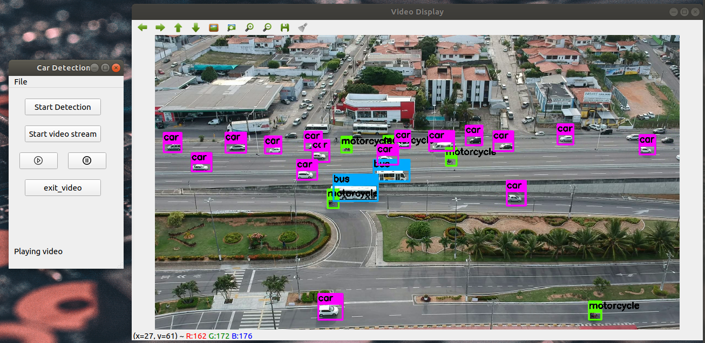
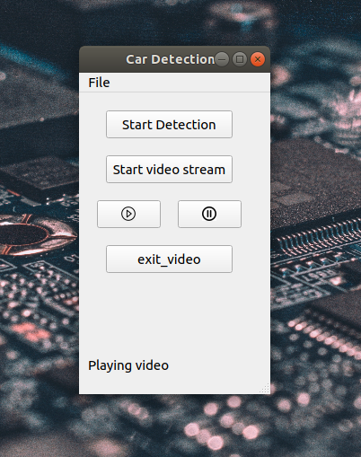
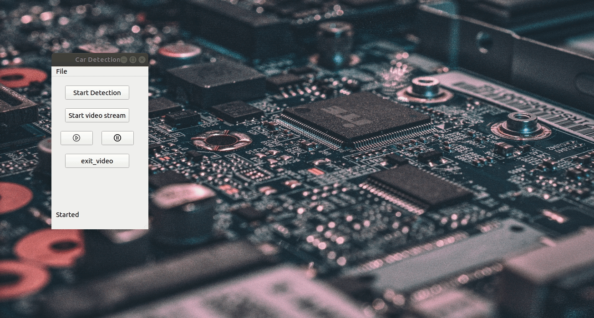

# Yolo_app



A visual interface developed with python to support object detection tests and output visualization. This application uses the YOLO convolutional neural network as a base object detector.

## Getting started

### Clone the repository

The first thing you should do is clone this repository to your computer. To this run the following command in your terminal.

```console
user@computer:~$ git clone https://github.com/eluire/Yolo_app.git
```

### Installing and configure Yolo CNN.

First, you need to configure your system to run YOLO CNN, to this, visit
the following repository.[Click here](https://github.com/vanluwin/enviroment)
https://github.com/vanluwin/enviroment)

After this, you are able to execute the YOLO CNN, in this repository, we provide a folder called darknet, open it and run the following command in your terminal


```console
user@computer:~/yolo_app/darknet$ make
```
If you want to know more about how the YOLO Convolutional neural network works, visit these sites.[Official repository](https://pjreddie.com/darknet/yolo/), [Official site](https://github.com/AlexeyAB/darknet#how-to-train-to-detect-your-custom-objects)

### Weigths

We make available to you a specific weight file to vehicles detection, if you want to download this file click on the following link.[Click here](link_pro_download)

If you want to know how we create this weight file, see all of the statistics,detection metrics and more about our job with image processor and object detection, check the following link.[Click here](link para artigo)

But if you have your own file of weights just move to the darknet folder.

### Create a new virtual environment.

To install anaconda package manager follow the official installation guide.[Click here](https://docs.anaconda.com/anaconda/install/linux/)

We make available a file named *pyqt.yaml*, which is no more than a complete setup with all needed packages to run this app.

Run the following command in your console:

```console
user@computer:~/yolo_app$ conda env create -f pyqt.yaml
```

If your environment was created correctly, execute this to enter activate it:

```console
user@computer:~/yolo_app$ conda activate pyqt
```

So now let's get started with Yolo app!

## Steps to use

### Executing the yolo_app interface.

Inside of your virtual environment run the following command:

```console
[pyqt]user@computer:~/yolo_app$ python yolo.py
```
if everything is correct, you will see this screen.



Now you should choose some essential files. If you already have your setup to test feel free to select other files. In this repository we make available default files to your test, just follow the steps below to set your test setup.

**1. Select the video file.**

Obs: this is a video that you want to detect.


**2. Select the weight file.**



**3. Select the data file.**

Obs: this is file contains information about the classes to detection.


**4. Select the cfg file.**

Obs: this is file contains a convolutional neural network configuration.


